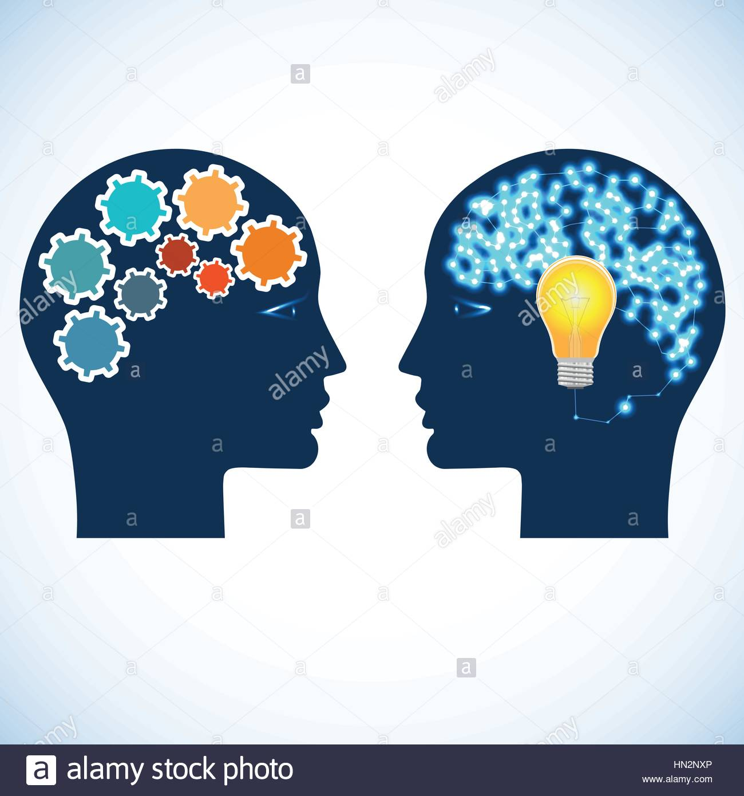

JavaScript is fun so far! Reason for that? I code in C most of the time before coming in to
contact with Javascript. Computer languages are sometimes like people, I would compare C to 
a person that is very specific in everything, and JavaScript would be someone who is very relax
on everything. It's easier to code in JavaScript since there is less rule in the syntax of this
languages. Comparing C and Javascrit, I enjoy coding in C and also learned a lot from it, but I 
had so much fun with Javascript.

The athletic software engineering style that we did in class is great. I have only done it once so
far, so I would need a few more trials in order to give it an objective evaluation. So far, the WOD
is pretty nerve-racking, especially when I am so new to this language, and also not familiar with WOD 
excersices. However, everyone in the class feel the same way, that turns my stress into an excitement. 
I am therefore looking forward to the future WODs!
