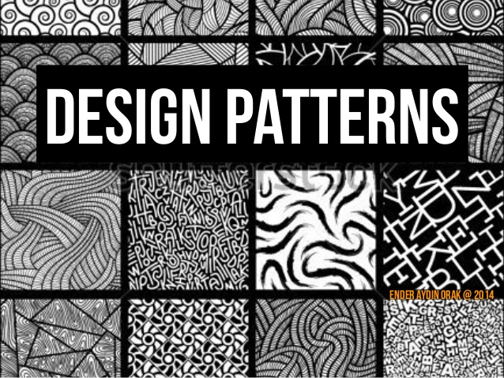

Ever encountered a time when you try to explain how your project works and it always take so long to describe the 
structure of your code before you can get to the details? What if there is a name for every different structure and 
you can simply mention their names and hop right into the meat of your discussion. There’s a term for all these 
structures, it’s called design patterns, and every design pattern has its name. Yes, so now when you try to give a 
description of how you created different classes that can all access the one global variable, you can simply say that 
you use a singleton pattern; and for the times that you try to describe how you set up this routing page to allow the 
interface page to access data from the data file, you can simply explain as you are using the MVC pattern, etc. How 
much easier does this make your life! So go look up some design pattern terms and save yourself some time in a discussion 
and some face in an interview!

I did this one project with my team, we made an app that allows people to sign up and find matching pals to practice the 
language they are learning. with the understanding of what design patterns are now, it’s interesting to point out the 
patterns that we used in our project that we didn’t know then. In our project, we used MongoDB to store datas and we 
use React library for a lot of our interface implementation, and we also used React Router to route files and do the 
linkage between pages, and that, is an obvious MVC(Modal, View, Control) pattern right there. We also use a Publish 
and Subscribe design to keep the profile displays for all users up to date.
