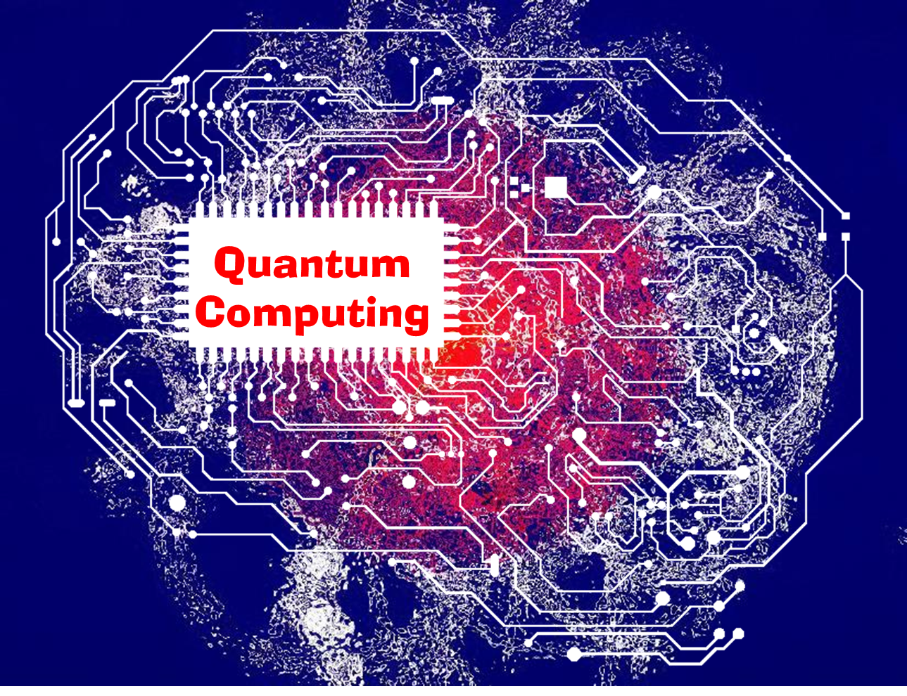

Quantum computing is a project I reasearched and did presentation on. The research focused on how quantum
computer is a new threat to modern cryptography, and methods to work around the threat.

The presentation elaborate the topic in different sections such as "what is the difference between quantum and classic 
computer?", "How does quantum cryptography work?", etc.

Through out the process of researching on this sunbject, I gained much better understanding on the subject, and I am 
able to explain subject matters to my fellows.
